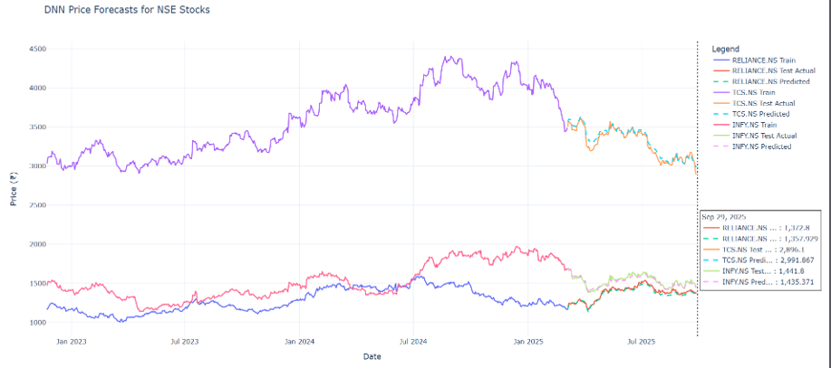
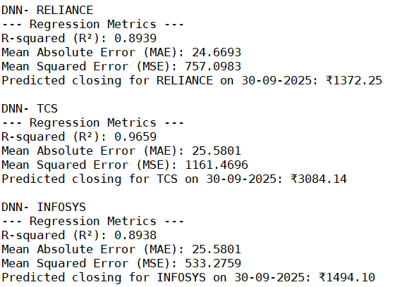
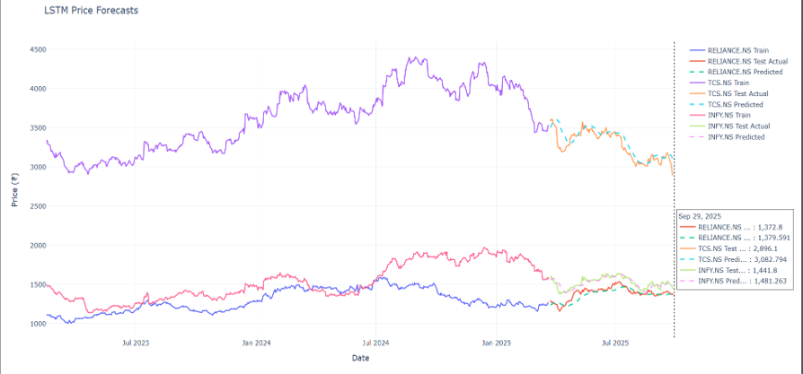
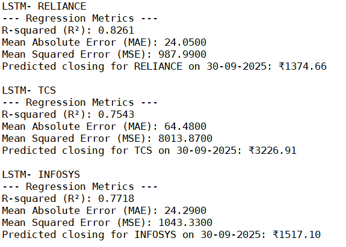
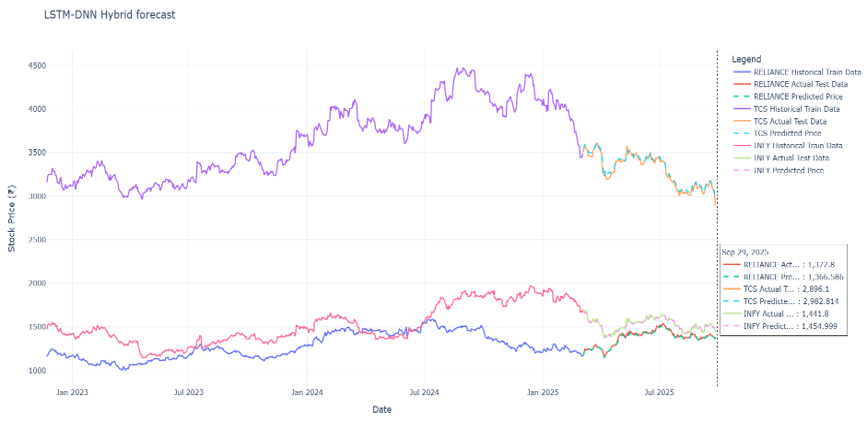
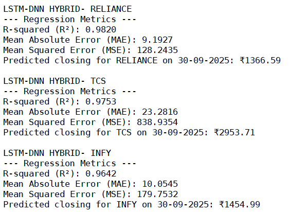

# Adaptive-Stock-Prediction-LSTM-DNN
End-to-end adaptive stock price prediction system using ARIMA, GARCH, CNN-LSTM, BiLSTM-Transformer, and a novel LSTM-DNN hybrid model with incremental learning and sliding window techniques, achieving high accuracy and real-time adaptability.

## 📊 Baseline Models: ARIMA & GARCH

### 🔹 ARIMA Model (Trend Forecasting)

ARIMA (AutoRegressive Integrated Moving Average) is used as a statistical baseline model to capture linear trends in stock price time-series data.

#### 📸 Results


#### 🔍 Inference – ARIMA

* Accuracy ranges between ~49–59% (close to random baseline)
* Strong bias toward predicting downward trends
* Very low recall for upward movements (fails to capture bullish signals)
* Produces smooth forecasts that miss sudden market fluctuations
* Captures linear patterns but fails in nonlinear environments

👉 **Conclusion:** ARIMA is useful for basic trend analysis but not suitable for real-world stock prediction.


### 🔹 GARCH Model (Volatility Modeling)

GARCH (Generalized Autoregressive Conditional Heteroskedasticity) is used to model time-varying volatility in stock returns.

#### 📸 Results


#### 🔍 Inference – GARCH

* Successfully captures market volatility
* Produces smooth and nearly static forecasts
* Assumes mean return ≈ 0, limiting predictive capability
* Fails to respond to sudden price changes
* Weak directional prediction performance

👉 **Conclusion:** GARCH is effective for volatility estimation but not suitable for accurate stock price prediction.


## 🔥 Key Insight

* ARIMA → Captures linear trends but fails in nonlinear markets
* GARCH → Models volatility but not actual price movement
* Both models show poor directional accuracy

👉 These limitations motivate the use of deep learning models such as DNN and LSTM-DNN.

## 🧠 DNN Model (Deep Neural Network)

---

### ⚙️ Methodology

* **Data Collection:**
  Three-year OHLCV data for RELIANCE.NS, TCS.NS, and INFY.NS fetched using `yfinance`

* **Feature Engineering:**
  Technical indicators added:

  * EMA (20)
  * RSI (14)
  * MACD (12,26,9)
  * MACD Signal

  Final features:

  ```
  Open, High, Low, Close, Volume, EMA_20, RSI_14, MACD, MACD Signal
  ```

* **Preprocessing:**

  * MinMaxScaler normalization
  * Chronological split (80% train, 20% test)
  * Target variable: Closing Price


### 🧱 Model Architecture

* Dense layers: **64 → 32 neurons**
* Activation: **LeakyReLU**
* Dropout: **0.3, 0.2**
* Optimizer: **Adam (lr = 0.004)**
* Loss Function: **Huber Loss**
* EarlyStopping applied
* Training: up to 200 epochs with validation

---

### 📊 Performance

| Stock    | R² Score | Insight            |
| -------- | -------- | ------------------ |
| TCS      | ~0.965   | Highest accuracy   |
| RELIANCE | ~0.894   | Strong performance |
| INFY     | ~0.894   | Stable predictions |

* **MAE:** ~₹25 → Low average prediction error
* **MSE:** Indicates variability in prediction stability


### 🔍 Inference

* Learns **nonlinear relationships** between price and indicators

* Achieves high accuracy, especially for stable stocks

* Shows **trend-following behavior** (extends recent trends)

* Performs well for **short-term predictions**

* Struggles with:

  * Sudden reversals
  * High volatility spikes

* Model consistency varies:

  * **INFY:** Most stable (lowest MSE)
  * **TCS:** High accuracy but occasional large errors

👉 **Conclusion:**
DNN significantly improves prediction accuracy over traditional models by capturing nonlinear patterns, but lacks temporal awareness, limiting performance in highly volatile conditions.


### 📸 Results






## 🔹 LSTM Model (Long Short-Term Memory)


### ⚙️ Methodology

* **Data Collection:**
  Three-year OHLCV data for RELIANCE.NS, TCS.NS, and INFY.NS collected using `yfinance`

* **Feature Engineering:**
  Technical indicators added:

  * EMA (20)
  * RSI (14)
  * MACD (12,26,9)
  * MACD Signal

  Final features include OHLCV + technical indicators

* **Preprocessing:**

  * MinMaxScaler normalization
  * 60-day sliding window for sequence creation
  * Chronological split (80% train, 20% test)
  * Target variable: Closing Price


### 🧱 Model Architecture

* Stacked LSTM layers: **128 → 64 units**
* Dropout: **0.3, 0.2**
* Output: Dense(1)
* Optimizer: **Adam (lr = 0.0004)**
* Loss Function: **Huber Loss**
* EarlyStopping applied
* Training: up to 200 epochs


### 📊 Performance

| Stock    | R² Score | Insight              |
| -------- | -------- | -------------------- |
| RELIANCE | ~0.826   | Best performance     |
| INFY     | ~0.772   | Moderate performance |
| TCS      | ~0.754   | Weak performance     |

* **MAE:**

  * RELIANCE: ~₹24
  * INFY: ~₹24
  * TCS: ~₹64 (high error)

* **MSE:**

  * RELIANCE: Lowest → most stable
  * TCS: Highest → frequent large errors


### 🔍 Inference

* Captures **temporal dependencies** using sequential data

* Performs well for:

  * Stable stocks
  * Clear trending patterns

* Struggles with:

  * High volatility
  * Sudden trend reversals

* Observations:

  * **Lagging behavior** in predictions (especially for TCS)
  * Predictions fail to keep up with rapid price changes
  * Short-term predictions reasonable for RELIANCE and INFY
  * Performance varies significantly across stocks

👉 **Conclusion:**
LSTM effectively models time-series dependencies but suffers from lag and inconsistency in highly volatile conditions, limiting its standalone performance.

---

### 📸 Results





## 🔥 Proposed Model: LSTM–DNN Hybrid

---

### ⚙️ Methodology

* **Data Collection:**
  Three-year OHLCV data for RELIANCE.NS, TCS.NS, and INFY.NS fetched using `yfinance`

* **Feature Engineering:**
  Technical indicators generated using `pandas_ta`:

  * EMA (20)
  * RSI (14)
  * MACD (12,26,9)
  * MACD Signal

  Final features:

  ```
  Open, High, Low, Close, Volume, EMA_20, RSI_14, MACD, MACD Signal
  ```

* **Preprocessing:**

  * MinMaxScaler normalization
  * Chronological split (80% train, 20% test)
  * Target: Closing Price

---

### 🧱 Model Architecture

The hybrid model combines **temporal learning (LSTM)** and **nonlinear learning (DNN)**:

#### 🔹 LSTM Block

* LSTM layers: **128 → 64 units**
* Dropout: **0.3, 0.2**

#### 🔹 DNN Block

* Dense layers: **128 → 64 neurons**
* Activation: **LeakyReLU**
* Dropout applied

#### 🔹 Output Layer

* Dense(1) → predicts closing price

* Optimizer: **Adam (lr = 0.001)**

* Loss Function: **Huber Loss**

* EarlyStopping applied


### 📊 Performance (Best Model 🔥)

| Stock    | R² Score  |
| -------- | --------- |
| RELIANCE | **0.982** |
| TCS      | **0.975** |
| INFY     | **0.964** |

* **Lowest MSE across all models**
* High consistency and stability
* Strong generalization across stocks


### 🔍 Inference

* Captures both:

  * **Temporal dependencies** (via LSTM)
  * **Nonlinear relationships** (via DNN)

* Key Observations:

  * Predictions closely follow actual prices
  * Accurately captures trends and short-term fluctuations
  * Handles both stable and volatile markets effectively
  * Reacts quickly to market changes with minimal lag
  * Maintains high accuracy across all stocks

* Performance Insights:

  * RELIANCE & INFY → most stable predictions (low MSE)
  * TCS → handles volatility better than other models

👉 **Conclusion:**
The LSTM–DNN hybrid model significantly outperforms ARIMA, GARCH, DNN, and LSTM by combining their strengths, resulting in highly accurate, stable, and adaptive stock price predictions.

---

### 📸 Results




---

## 🚀 Final Takeaway

* Traditional Models → ❌ Limited
* DNN → ✅ Nonlinear
* LSTM → ✅ Temporal
* **LSTM-DNN → 🔥 Best (Combined Power)**

👉 Recommended for real-world stock prediction systems.
# 🚀 Proposed Model: Adaptive LSTM-DNN (Incremental Learning + Sliding Window)

---

## 🎯 Problem Statement

Stock market prediction is challenging due to:

- Nonlinear and non-stationary nature of financial data  
- High volatility and sudden market shifts  
- Limitations of static models that do not adapt to new data  

👉 To solve this, we propose an **adaptive hybrid LSTM-DNN model** with:
- Incremental Learning  
- Sliding Window Mechanism  

📌 Based on final implementation: :contentReference[oaicite:0]{index=0}

---

## 💡 Key Contribution

- Hybrid **LSTM + DNN architecture**
- **Incremental learning** for real-time updates
- **Sliding window (60 days optimal)** for trend capture
- Dual prediction:
  - Price prediction (Regression)
  - Direction prediction (Classification)

---

## ⚙️ Methodology

### 🔹 Data Collection
- 3+ years OHLCV data using `yfinance`
- Stocks: RELIANCE, TCS, INFY + indices (NIFTY, SENSEX)

---

### 🔹 Feature Engineering
- 30+ features including:
  - EMA (9, 21, 50)
  - RSI (14)
  - MACD + Signal + Histogram
  - Bollinger Bands
  - ATR, volatility, momentum indicators
  - Log returns, trend strength, streak, divergence

---

### 🔹 Preprocessing
- MinMax / Robust Scaling
- Chronological split (80% train, 20% test)
- Sliding window: **60 days (optimal)**

---

### 🔹 Model Architecture
## 🧠 Model Architecture (Incremental Learning + Sliding Window)


The proposed model integrates LSTM and DNN with incremental learning and a sliding window approach to enable real-time adaptability.


#### 🧠 Hybrid LSTM-DNN

- **LSTM Layers**
  - 96 → 64 units
  - Captures temporal dependencies

- **DNN Layers**
  - 128 → 64 units
  - Learns nonlinear relationships

- **Dual Output Heads**
  - Regression → Next-day price
  - Classification → Direction (Up/Down)

---

### 🔹 Training Strategy

- **Loss Functions**
  - Huber Loss (Regression)
  - Focal Loss (Direction)

- **Loss Weighting**
  - Direction prioritized (1 : 4 ratio)

- EarlyStopping + Gradient Clipping

---

### 🔹 Sliding Window 📊

- Uses last **60 days data**
- Best balance:
  - Accuracy ✅
  - Stability ✅
  - Responsiveness ✅

### 🔹 Incremental Learning 🔄

- Model **updates continuously**
- Retrained on **latest window only**
- No full retraining required

👉 Handles:
- Concept drift  
- Changing market trends  


### 🔹 Evaluation Strategy

- Walk-forward validation (no leakage)
- Metrics:
  - R² Score
  - MAE, MSE, RMSE, MAPE
  - Directional Accuracy


## 📸 Results


## 📊 Performance Summary

| Metric | Performance |
|------|------------|
| R² Score | **0.93 – 0.99** |
| Directional Accuracy | **68% – 85%** |
| RMSE | Low across stocks |
| MAE | Stable and minimal |

---

## 🔍 Inference

- ✅ **Very high model accuracy** across all stocks  
- ✅ Strong performance on:
  - SBI (highest R² ~0.989)
  - Infosys (best direction ~85%)  

- ✅ Captures:
  - Nonlinear patterns  
  - Temporal dependencies  

- ✅ Works across:
  - Indices (NIFTY, SENSEX)  
  - IT stocks (TCS, INFY)  
  - Banking (SBI, Axis Bank)  

- ✅ Stable predictions with low RMSE and MAE  

- ⚠️ Minor limitation:
  - Slight delay during extreme volatility spikes  

---

## 💡 Key Advantages

- Real-time adaptability (incremental learning)  
- Strong short-term trend capture (sliding window)  
- High directional accuracy → trading usefulness  
- Generalizes across multiple stocks  

---

## 🔥 Final Conclusion

The **Adaptive LSTM-DNN model**:

- Outperforms:
  - ARIMA
  - GARCH
  - DNN
  - LSTM
  - CNN-LSTM
  - BiLSTM-Transformer  

- Provides:
  - Accurate predictions  
  - Stable performance  
  - Real-time adaptability  

👉 Suitable for:
- Stock forecasting  
- Trading decision support  
- Real-time financial systems  

---

## 🛠️ Tech Stack

* Python
* Pandas, NumPy
* Statsmodels (ARIMA)
* ARCH (GARCH)
* Scikit-learn
* Plotly
  
## 👩‍💻 Author

Eashita Prabhudesai

