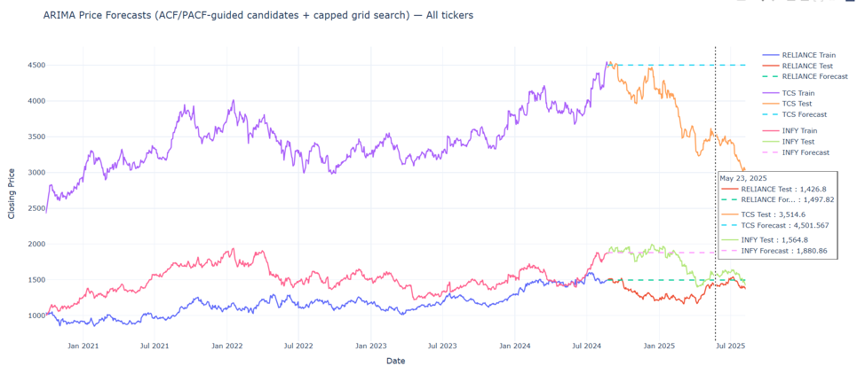
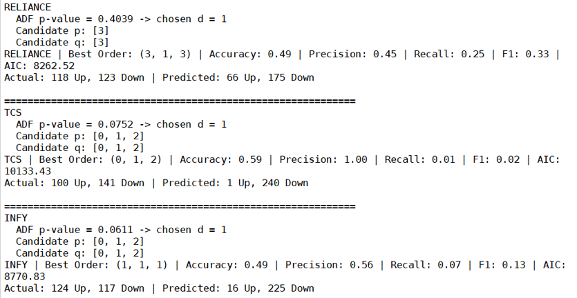
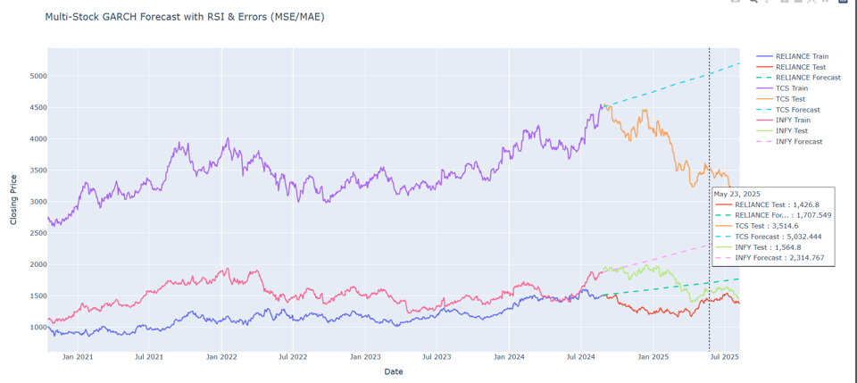
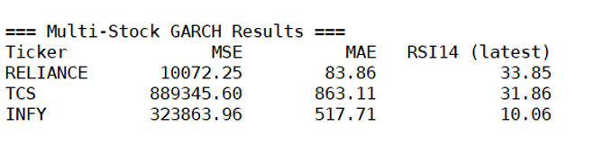
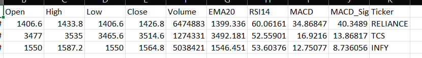

# Adaptive-Stock-Prediction-LSTM-DNN
End-to-end adaptive stock price prediction system using ARIMA, GARCH, CNN-LSTM, BiLSTM-Transformer, and a novel LSTM-DNN hybrid model with incremental learning and sliding window techniques, achieving high accuracy and real-time adaptability.

## 📊 Baseline Models: ARIMA & GARCH

### 🔹 ARIMA Model (Trend Forecasting)

ARIMA (AutoRegressive Integrated Moving Average) is used as a statistical baseline model to capture linear trends in stock price time-series data.

#### 📸 Results

#### 🔍 Inference – ARIMA

* Accuracy ranges between ~49–59% (close to random baseline)
* Strong bias toward predicting downward trends
* Very low recall for upward movements (fails to capture bullish signals)
* Produces smooth forecasts that miss sudden market fluctuations
* Captures linear patterns but fails in nonlinear environments

👉 **Conclusion:** ARIMA is useful for basic trend analysis but not suitable for real-world stock prediction.

---

### 🔹 GARCH Model (Volatility Modeling)

GARCH (Generalized Autoregressive Conditional Heteroskedasticity) is used to model time-varying volatility in stock returns.

#### 📸 Results

#### 🔍 Inference – GARCH

* Successfully captures market volatility
* Produces smooth and nearly static forecasts
* Assumes mean return ≈ 0, limiting predictive capability
* Fails to respond to sudden price changes
* Weak directional prediction performance

👉 **Conclusion:** GARCH is effective for volatility estimation but not suitable for accurate stock price prediction.

---

## 🔥 Key Insight

* ARIMA → Captures linear trends but fails in nonlinear markets
* GARCH → Models volatility but not actual price movement
* Both models show poor directional accuracy

👉 These limitations motivate the use of deep learning models such as DNN and LSTM-DNN.

---

## 🛠️ Tech Stack

* Python
* Pandas, NumPy
* Statsmodels (ARIMA)
* ARCH (GARCH)
* Scikit-learn
* Plotly

---

## 👩‍💻 Author

Eashita Prabhudesai

